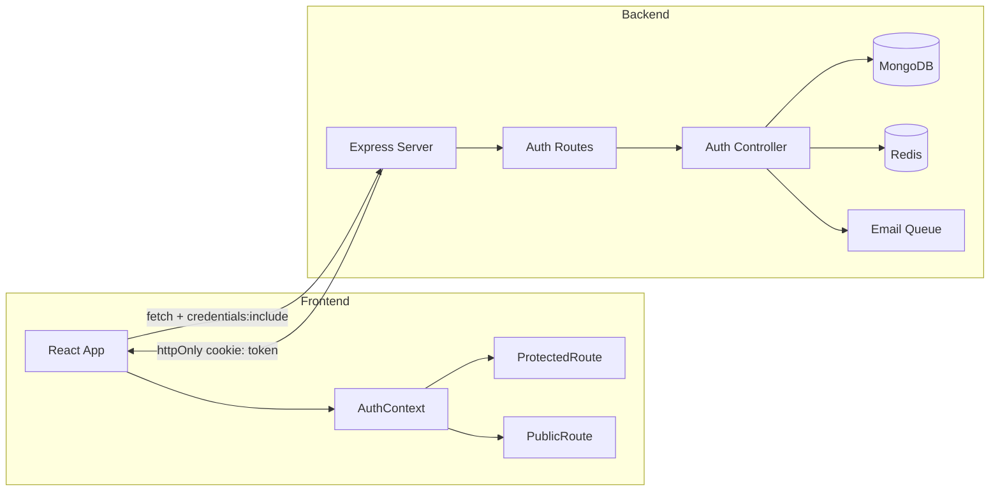
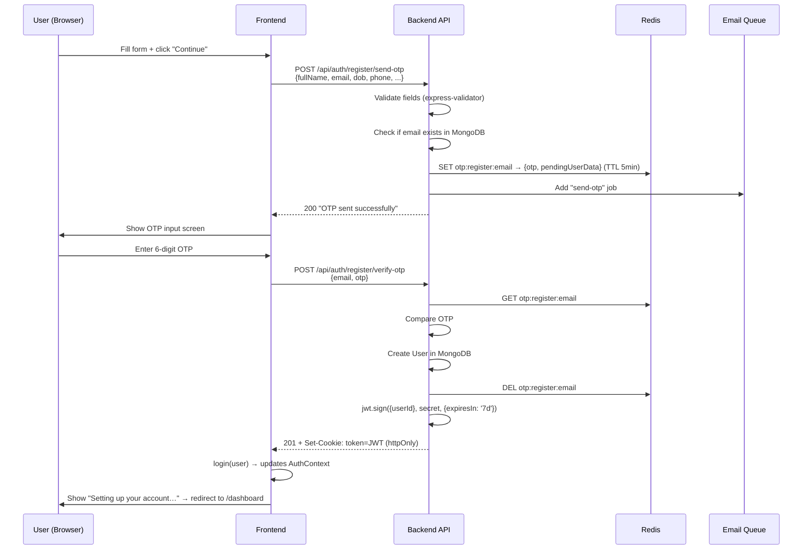
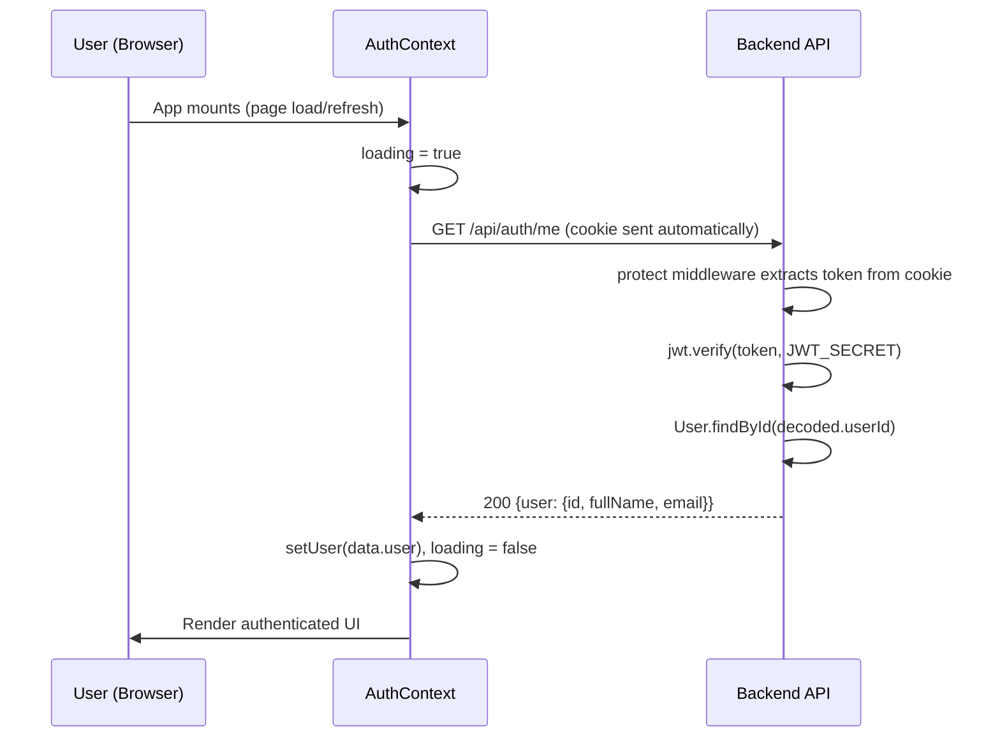
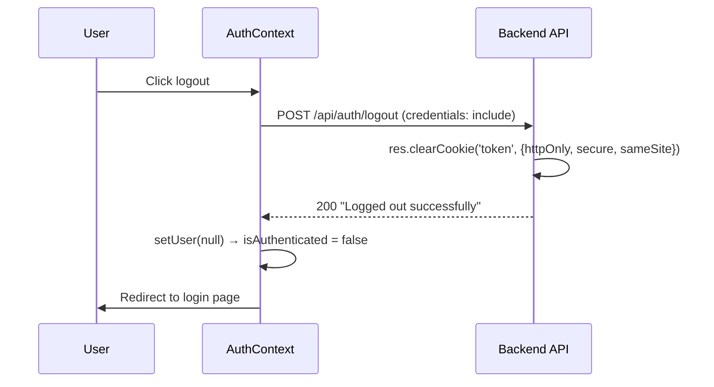

# JWT Authentication Flow — ExpenseIQ

## Architecture Overview

ExpenseIQ uses a **passwordless, OTP-based authentication** system with **JWTs stored in httpOnly cookies**. There are no passwords anywhere — users authenticate via a 6-digit OTP sent to their email.



## Key Design Decisions

| Decision | Implementation |
|---|---|
| **No passwords** | OTP-only auth via email |
| **Token storage** | httpOnly cookie (not localStorage) — immune to XSS |
| **OTP storage** | Redis with 5-minute TTL — auto-expires |
| **Email dispatch** | BullMQ background job — API returns instantly |
| **Token lifetime** | 7 days (`expiresIn: '7d'`) |
| **Cookie security** | `secure` + `sameSite: strict` in production |

---

## Flow 1: Registration



### Files involved

| File | Role |
|---|---|
| [RegisterPage.jsx](file:///home/karthikeya/Viswa/Projects/Expense%20Tracker/frontend/src/pages/RegisterPage.jsx) | Collects form data, sends OTP request, verifies OTP, calls [login()](file:///home/karthikeya/Viswa/Projects/Expense%20Tracker/backend/controllers/authController.js#109-136) |
| [auth.js routes](file:///home/karthikeya/Viswa/Projects/Expense%20Tracker/backend/routes/auth.js#L24-L53) | `POST /register/send-otp` and `POST /register/verify-otp` with validation |
| [authController.js](file:///home/karthikeya/Viswa/Projects/Expense%20Tracker/backend/controllers/authController.js#L28-L107) | [registerSendOtp](file:///home/karthikeya/Viswa/Projects/Expense%20Tracker/backend/controllers/authController.js#24-57) + [registerVerifyOtp](file:///home/karthikeya/Viswa/Projects/Expense%20Tracker/backend/controllers/authController.js#58-108) — OTP/Redis/JWT logic |
| [User.js](file:///home/karthikeya/Viswa/Projects/Expense%20Tracker/backend/models/User.js) | Mongoose schema — user created here on verify |

---

## Flow 2: Login

```mermaid
sequenceDiagram
    participant U as User (Browser)
    participant F as Frontend
    participant B as Backend API
    participant R as Redis
    participant Q as Email Queue

    U->>F: Enter email + click "Send OTP"
    F->>B: POST /api/auth/login/send-otp {email}
    B->>B: Find user by email in MongoDB
    B->>R: SET otp:login:email → otp (TTL 5min)
    B->>Q: Add "send-otp" job
    B-->>F: 200 "OTP sent"
    F->>U: Show OTP input screen

    U->>F: Enter 6-digit OTP
    F->>B: POST /api/auth/login/verify-otp {email, otp}
    B->>R: GET otp:login:email
    B->>B: Compare OTP
    B->>R: DEL otp:login:email
    B->>B: jwt.sign({userId}, secret, {expiresIn: '7d'})
    B-->>F: 200 + Set-Cookie: token=JWT (httpOnly)
    F->>F: login(user) → updates AuthContext
    F->>U: Show "Signing you in…" → redirect to /dashboard
```



> [!NOTE]
> Login stores **only the OTP string** in Redis (not user data), since the user already exists in MongoDB. Registration stores both the OTP and the pending user data.

---

## Flow 3: Session Persistence (Page Refresh)

When the app loads, `AuthContext` verifies the existing cookie:



If the cookie is missing, expired, or the user no longer exists, the `/me` endpoint returns a non-200 response → `user` stays `null` → `isAuthenticated` is `false`.

### The [protect](file:///home/karthikeya/Viswa/Projects/Expense%20Tracker/backend/middleware/auth.js#4-44) middleware in detail

```js
// 1. Extract token from httpOnly cookie
const token = req.cookies?.token;
// 2. Verify with jsonwebtoken
const decoded = jwt.verify(token, process.env.JWT_SECRET);
// 3. Fetch user from DB (ensure they still exist)
const user = await User.findById(decoded.userId).select('-__v');
// 4. Attach to request
req.user = user;
```

Source: [auth.js middleware](file:///home/karthikeya/Viswa/Projects/Expense%20Tracker/backend/middleware/auth.js)

---

## Flow 4: Route Protection (Frontend)

| Component | Behavior |
|---|---|
| [PublicRoute](file:///home/karthikeya/Viswa/Projects/Expense%20Tracker/frontend/src/components/PublicRoute.jsx) | If `loading` → show PageLoader. If `isAuthenticated` → redirect to `/dashboard`. Otherwise render children. |
| [ProtectedRoute](file:///home/karthikeya/Viswa/Projects/Expense%20Tracker/frontend/src/components/ProtectedRoute.jsx) | If `loading` → show PageLoader. If `!isAuthenticated` → redirect to `/login`. Otherwise render children. |

This ensures:
- **Logged-in users** can't access landing/login/register pages (auto-redirected to dashboard)
- **Unauthenticated users** can't access dashboard (auto-redirected to login)

---

## Flow 5: Logout



Source: [authController.js logout](file:///home/karthikeya/Viswa/Projects/Expense%20Tracker/backend/controllers/authController.js#L182-L189)

---

## JWT Token Structure

```js
// Payload signed into the JWT:
{ userId: "MongoDB ObjectId" }

// Signing:
jwt.sign({ userId: user._id }, process.env.JWT_SECRET, { expiresIn: '7d' })
```

The token is **never exposed to JavaScript** — it lives only in the httpOnly cookie. The frontend never reads or passes the token manually; the browser sends it automatically via `credentials: 'include'` on every `fetch` call.

## Cookie Configuration

```js
{
  httpOnly: true,                                          // JS can't read it → XSS-safe
  secure: process.env.NODE_ENV === 'production',           // HTTPS only in prod
  sameSite: process.env.NODE_ENV === 'production' ? 'strict' : 'lax',  // CSRF protection
  maxAge: 7 * 24 * 60 * 60 * 1000                         // 7 days
}
```

Source: [authController.js cookieOptions](file:///home/karthikeya/Viswa/Projects/Expense%20Tracker/backend/controllers/authController.js#L11-L16)

---

## Complete File Map

| Layer | File | Purpose |
|---|---|---|
| **Frontend** | [AuthContext.jsx](file:///home/karthikeya/Viswa/Projects/Expense%20Tracker/frontend/src/context/AuthContext.jsx) | Manages `user`, `loading`, `isAuthenticated`, [login()](file:///home/karthikeya/Viswa/Projects/Expense%20Tracker/backend/controllers/authController.js#109-136), [logout()](file:///home/karthikeya/Viswa/Projects/Expense%20Tracker/backend/controllers/authController.js#178-190) |
| | [ProtectedRoute.jsx](file:///home/karthikeya/Viswa/Projects/Expense%20Tracker/frontend/src/components/ProtectedRoute.jsx) | Guards authenticated routes |
| | [PublicRoute.jsx](file:///home/karthikeya/Viswa/Projects/Expense%20Tracker/frontend/src/components/PublicRoute.jsx) | Guards public routes from logged-in users |
| | [LoginPage.jsx](file:///home/karthikeya/Viswa/Projects/Expense%20Tracker/frontend/src/pages/LoginPage.jsx) | Login UI (email → OTP → dashboard) |
| | [RegisterPage.jsx](file:///home/karthikeya/Viswa/Projects/Expense%20Tracker/frontend/src/pages/RegisterPage.jsx) | Registration UI (details → OTP → dashboard) |
| **Backend** | [server.js](file:///home/karthikeya/Viswa/Projects/Expense%20Tracker/backend/server.js) | Express setup with cors, cookieParser |
| | [auth.js routes](file:///home/karthikeya/Viswa/Projects/Expense%20Tracker/backend/routes/auth.js) | 5 endpoints + input validation |
| | [authController.js](file:///home/karthikeya/Viswa/Projects/Expense%20Tracker/backend/controllers/authController.js) | Core auth logic (OTP + JWT + cookies) |
| | [auth.js middleware](file:///home/karthikeya/Viswa/Projects/Expense%20Tracker/backend/middleware/auth.js) | [protect](file:///home/karthikeya/Viswa/Projects/Expense%20Tracker/backend/middleware/auth.js#4-44) middleware — JWT verification |
| | [User.js](file:///home/karthikeya/Viswa/Projects/Expense%20Tracker/backend/models/User.js) | Mongoose user schema |
| | [redis.js](file:///home/karthikeya/Viswa/Projects/Expense%20Tracker/backend/config/redis.js) | Redis client + BullMQ connection config |
